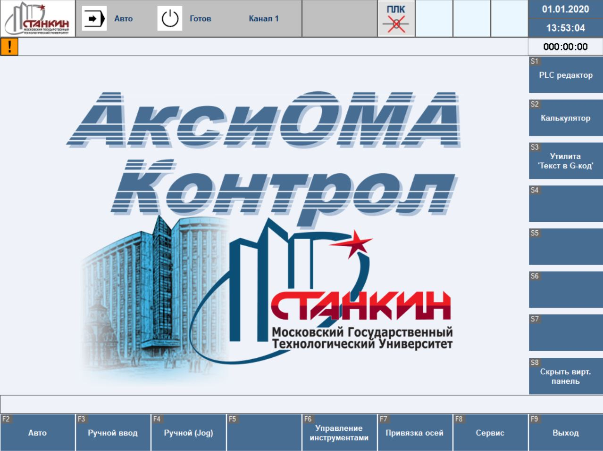

# OPC-UA-Server-for-CNC
## Данная программа предоставляет доступ к необходимым данным для диагностики и мониторинга СЧПУ АксиОМА КОНТРОЛ по протоколу OPC UA.

## Используется библеотека [open62541](https://github.com/open62541/open62541) для построение аддресного пространство сервера OPC UA, реализованную на языке Си.

# Задачи
- [x] Перенос проекта для разработки на vsCode
- [x] Реализация библеотеки для логирование 
- [x] Реализания механизм общение с СЧПУ по общей памяти
- [x] Сериелизация по стандарту msgpack (like JSON)
- [ ] Реализация OPC UA сервера
- [ ] Реализация проткола общении между сервером и СЧПУ 
 
